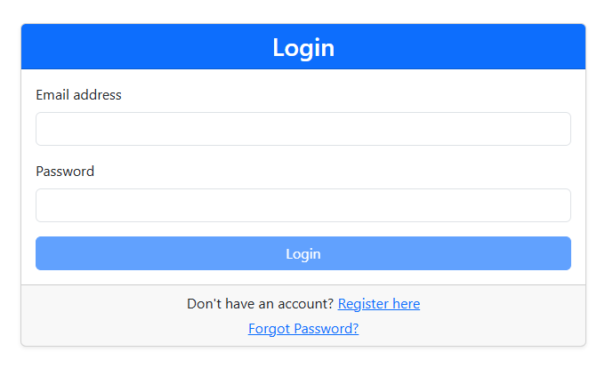
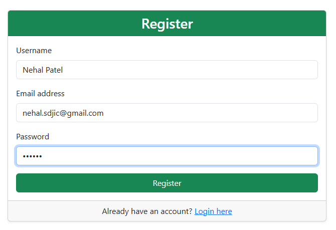
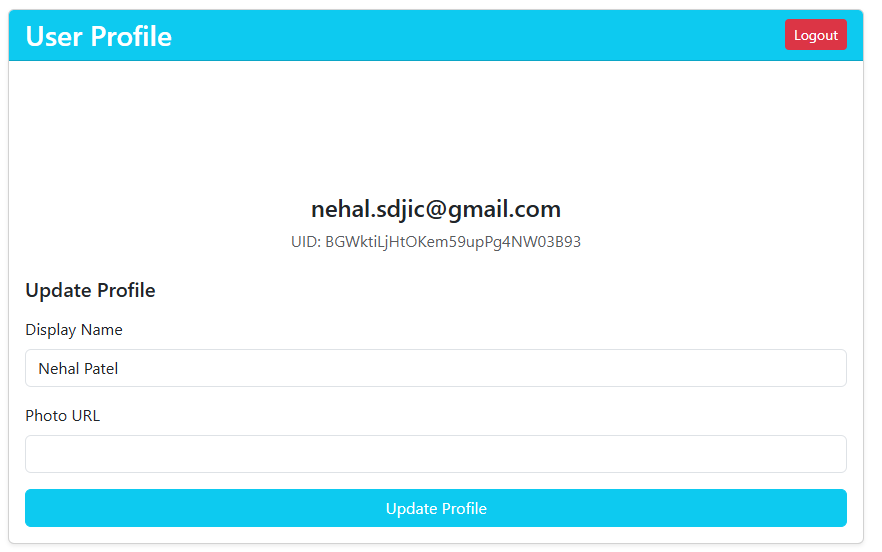

# Angular 17 + Firebase Authentication Student Guide

Welcome! This guide is designed for students building an authentication system from scratch. It walks you through creating a new Angular 17 application, configuring Firebase, and implementing secure user authentication.

---

## 1. Prerequisites

Before starting, ensure your environment meets these requirements:

*   **Node.js**: Version `18.13.0` or higher (LTS recommended).
    *   *Check version*: `node -v`
*   **Angular CLI**: Version `17.x`.
    *   *Install/Update*: `npm install -g @angular/cli@17`
    *   *Check version*: `ng version`
*   **Code Editor**: VS Code (recommended) or WebStorm.
*   **Firebase Account**: A Google account to access the [Firebase Console](https://console.firebase.google.com/).

---

## 2. Angular Project Creation

### Step 1: Create the Project
Open your terminal and run the following command to generate a new Angular 17 workspace.

```bash
ng new angular-firebase-auth --standalone --routing --style=css
```

**Command Explanation:**
*   `--standalone`: Uses Standalone Components (modern Angular approach, no NgModules).
*   `--routing`: Sets up the router automatically.
*   `--style=css`: Uses standard CSS for styling.

### Step 2: Navigate to Project Directory
```bash
cd angular-firebase-auth
```

### Project Structure Overview
Your new project will have this structure:
*   `src/app/app.config.ts`: Main application configuration (replaces app.module.ts).
*   `src/app/app.routes.ts`: Route definitions.
*   `src/app/app.component.ts`: The root component.
*   `angular.json`: Workspace configuration.

---

## 3. Package Installation

Install the necessary libraries for Firebase connectivity and UI styling.

### Step 1: Install Dependencies
Run the following command to install specific versions of the required packages:

```bash
npm install @angular/fire@^17.1.0 bootstrap@^5.3.8
```

*   **@angular/fire**: Official Angular library for Firebase.
*   **bootstrap**: Popular CSS framework for responsive UI components.

---

## 4. Firebase Setup

### Step 1: Create a Project in Console
1.  Go to the [Firebase Console](https://console.firebase.google.com/).
2.  Click **"Add project"**.
    
    *Click Getting Start*
    
    *Give a Project name and continue*
    
    *Disable Google Gemini AI (Optional)*
    

3.  Name it (e.g., `auth-demo`) and disable Google Analytics for this tutorial.
4.  Click **"Create project"**.
5.  Add an application "Add App" in this project

    
6.  Select web app and give a unique application name
    *Caption: Navigate to the Authentication section under the Build menu.*

    
    
7.  Save all the credentials in a file.

    

### Step 2: Enable Authentication
1.  Select **Build** > **Authentication** from the left sidebar.


2.  Click **"Get started"**.
3.  Select the **Sign-in method** tab.
4.  Click **Email/Password**.

    

5.  Enable the **Email/Password** toggle and click **Save**.
    
    *Caption: Select Email/Password from the list of providers.*

    

    

    *Logged in users list will be shown here.*


## 3. Project Configuration

### Step 1: Configure Bootstrap
To make Bootstrap styles available, modify `angular.json`.

1.  Open `angular.json`.
2.  Locate `projects` > `angular-firebase-auth` > `architect` > `build` > `options` > `styles`.
3.  Add the Bootstrap CSS path **before** `src/styles.css`.
4.  Add the Bootstrap JS path to the `scripts` array.

**angular.json**:
```json
"styles": [
  "node_modules/bootstrap/dist/css/bootstrap.min.css",
  "src/styles.css"
],
"scripts": [
  "node_modules/bootstrap/dist/js/bootstrap.min.js"
]
```

### Step 2: Configure Firebase in Angular
Open `src/app/app.config.ts` and initialize Firebase using the config you copied earlier.

**src/app/app.config.ts**:
```typescript
import { ApplicationConfig } from '@angular/core';
import { provideRouter } from '@angular/router';
import { routes } from './app.routes';

// Import Firebase modules
import { initializeApp, provideFirebaseApp } from '@angular/fire/app';
import { getAuth, provideAuth } from '@angular/fire/auth';

// REPLACE with your actual config object from Firebase Console
const firebaseConfig = {
  apiKey: "AIzaSy...",
  authDomain: "YOUR_PROJECT.firebaseapp.com",
  projectId: "YOUR_PROJECT_ID",
  storageBucket: "YOUR_PROJECT.appspot.com",
  messagingSenderId: "...",
  appId: "..."
};

export const appConfig: ApplicationConfig = {
  providers: [
    provideRouter(routes),
    // Initialize Firebase
    provideFirebaseApp(() => initializeApp(firebaseConfig)),
    // Initialize Auth
    provideAuth(() => getAuth())
  ]
};
```

---

## 4. Component Implementation Guide

This section provides the complete code for building the authentication system. Follow these steps in order.

### 4.1 Authentication Service (`AuthService`)
**Purpose**: Centralizes all Firebase Authentication logic (Login, Register, Logout).
**Dependencies**: `AngularFireAuth`, `RxJS`.

**Command**:
```bash
ng generate service services/auth
```

**Implementation (`src/app/services/auth.service.ts`):**
```typescript
import { Injectable, inject } from '@angular/core';
import { Auth, createUserWithEmailAndPassword, signInWithEmailAndPassword, signOut, sendPasswordResetEmail, user, User, updateProfile } from '@angular/fire/auth';
import { Observable, from } from 'rxjs';

@Injectable({
  providedIn: 'root'
})
export class AuthService {
  private auth: Auth = inject(Auth);
  user$: Observable<User | null> = user(this.auth);

  register(email: string, username: string, password: string): Observable<void> {
    const promise = createUserWithEmailAndPassword(this.auth, email, password)
      .then(userCredential => updateProfile(userCredential.user, { displayName: username }));
    return from(promise);
  }

  login(email: string, password: string): Observable<void> {
    const promise = signInWithEmailAndPassword(this.auth, email, password).then(() => { });
    return from(promise);
  }

  logout(): Observable<void> {
    const promise = signOut(this.auth);
    return from(promise);
  }

  resetPassword(email: string): Observable<void> {
    const promise = sendPasswordResetEmail(this.auth, email);
    return from(promise);
  }

  updateProfile(displayName: string, photoURL?: string): Observable<void> {
    if (!this.auth.currentUser) return from(Promise.reject(new Error('No user logged in')));
    const promise = updateProfile(this.auth.currentUser, { displayName, photoURL });
    return from(promise);
  }
}
```

### 4.2 Authentication Guard (`AuthGuard`)
**Purpose**: Protects routes (like `/profile`) from being accessed by unauthenticated users.

**Command**:
```bash
ng generate guard guards/auth
```

**Implementation (`src/app/guards/auth.guard.ts`):**
```typescript
import { inject } from '@angular/core';
import { CanActivateFn, Router } from '@angular/router';
import { AuthService } from '../services/auth.service';
import { map, take, tap } from 'rxjs/operators';

export const authGuard: CanActivateFn = (route, state) => {
  const authService = inject(AuthService);
  const router = inject(Router);

  return authService.user$.pipe(
    take(1),
    map(user => !!user),
    tap(loggedIn => {
      if (!loggedIn) {
        router.navigate(['/login']);
      }
    })
  );
};
```

### 4.3 Login Component
**Purpose**: Allows existing users to sign in.

**Command**:
```bash
ng generate component components/login
```

**Implementation (`src/app/components/login/login.component.ts`):**
```typescript
import { Component, inject } from '@angular/core';
import { CommonModule } from '@angular/common';
import { FormBuilder, ReactiveFormsModule, Validators } from '@angular/forms';
import { Router, RouterModule } from '@angular/router';
import { AuthService } from '../../services/auth.service';

@Component({
  selector: 'app-login',
  standalone: true,
  imports: [CommonModule, ReactiveFormsModule, RouterModule],
  templateUrl: './login.component.html',
  styleUrl: './login.component.css'
})
export class LoginComponent {
  authService = inject(AuthService);
  router = inject(Router);
  fb = inject(FormBuilder);

  loginForm = this.fb.group({
    email: ['', [Validators.required, Validators.email]],
    password: ['', [Validators.required]]
  });

  errorMessage: string | null = null;
  isLoading = false;

  onSubmit(): void {
    if (this.loginForm.valid) {
      this.isLoading = true;
      this.errorMessage = null;
      const { email, password } = this.loginForm.value;

      this.authService.login(email!, password!).subscribe({
        next: () => {
          this.isLoading = false;
          this.router.navigate(['/profile']);
        },
        error: (err) => {
          this.isLoading = false;
          this.errorMessage = err.message;
        }
      });
    }
  }
}
```
*Note: The HTML template uses Bootstrap classes for styling (e.g., `card`, `form-control`, `btn-primary`).*



### 4.4 Register Component
**Purpose**: Creates new user accounts.

**Command**:
```bash
ng generate component components/register
```

**Implementation (`src/app/components/register/register.component.ts`):**
```typescript
// Similar structure to Login, but includes 'username' field and calls authService.register()
// ... imports ...
export class RegisterComponent {
  // ... injections ...
  registerForm = this.fb.group({
    username: ['', [Validators.required]],
    email: ['', [Validators.required, Validators.email]],
    password: ['', [Validators.required, Validators.minLength(6)]]
  });

  // onSubmit calls this.authService.register(email, username, password)
}
```


### 4.5 User Profile Component
**Purpose**: Displays user info and allows updates (Protected Route).

**Command**:
```bash
ng generate component components/user-profile
```

**Implementation (`src/app/components/user-profile/user-profile.component.ts`):**
```typescript
// ... imports ...
export class UserProfileComponent implements OnInit {
  authService = inject(AuthService);
  user: User | null = null;

  ngOnInit(): void {
    this.authService.user$.subscribe(user => {
      this.user = user;
      // Patch form values...
    });
  }

  logout(): void {
    this.authService.logout().subscribe(() => this.router.navigate(['/login']));
  }
}
```


### 4.6 Configure Routes
**Purpose**: Connect URLs to components.

**Implementation (`src/app/app.routes.ts`):**
```typescript
import { Routes } from '@angular/router';
import { LoginComponent } from './components/login/login.component';
import { RegisterComponent } from './components/register/register.component';
import { ForgotPasswordComponent } from './components/forgot-password/forgot-password.component';
import { UserProfileComponent } from './components/user-profile/user-profile.component';
import { authGuard } from './guards/auth.guard';

export const routes: Routes = [
  { path: '', redirectTo: '/login', pathMatch: 'full' },
  { path: 'login', component: LoginComponent },
  { path: 'register', component: RegisterComponent },
  { path: 'forgot-password', component: ForgotPasswordComponent },
  { path: 'profile', component: UserProfileComponent, canActivate: [authGuard] }
];
```

---

## 5 Run the project

Start the application to ensure the build is successful and dependencies are loaded.

```bash
npm start
```

*   Open your browser to `http://localhost:4200`.
